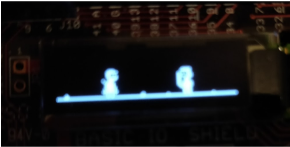
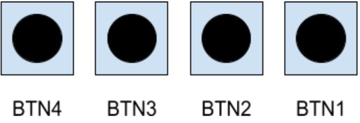

# DiveKick game
Created By Max Junestrand and Arvid Lagerqvist

Short description
We have created a simple fighting game, drawing inspiration from the game Divekick[link here]. The game’s objective is to eliminate the opponent by using different moves. The game has two modes, single player and multiplayer. In the single player mode you fight off against the machine, and in multiplayer versus another human. Playing the single player mode also generates a high score depending on how many times the machine is won over in a row.

Main requirements
Multiplayer mode where two players face eachother
Singleplayer mode where one player faces an AI
A highscore board where you can see how many times in a row you have won against the AI

Solution
This is a description of how we went about designing the game and what different design choices has been made.

Starting point 
The starting point of the project was lab 3. It was convenient as I/O, interrupts, polling as well as a game loop was 
already implemented.

General notes on the programming
When we started on the project we were a little bit lost since we had never worked in a language without oop-support before. When programming games it is often quite easy to fit different aspects of the game into an object oriented system. This lead us to trying to divide things up into different files and including them as needed. In the end we ended up with a lot of global variables and long variable names, however this wasn’t a very big problem since the project was relatively small and completed within a small time frame. In future similar projects using C we should probably consider using structs to make our data more structured.

Graphics
The function from lab 3 used to display graphics on the screen was of great use, but had some issues, it was hard to specify exactly which pixel we wanted to light up as the function split the screen into multiple strips of 8 pixels. We wanted to think about the screen as an array of 128*32 pixels, as that would greatly reduce the effort to draw the different characters and to think about their position on the screen. To solve this problem we created a function drawSprite() that takes an array of pixels 128*32 and transform it to the input the already implemented function display_image() wanted, we also modified display_image slightly so that it woudl cover the entire screen.
When we were confident in displaying certain pixels on different positions we drew the characters. This was done in a pixelart program and then extracted as 0s and 1s which indicate a either lit pixel or a black one. To display menu items we use the already defined function display_string().

Game logic
The update() function keeps an eye on flags and calculates physics by calculating player positions and their velocities and acceleration. The draw() function displays different images and strings depending on what certain flags and inputs are. 

How to play the game
This is description about how the game is played.
The objective of the game is to eliminate the opponent by using a combination of moves. What the buttons does is explained here, BTN4 and BTN3 is used by player1 and BTN2 and BTN1 is used by player 2.

The push buttons will have the following functions during gameplay:
Player 1:
BTN4 causes player 1 to jump back.
BTN3 causes player 1 to jump up if player 1 is on the ground.
BTN3 will cause player 1 to initiate a “divekick” (descending at a 45 degree angle forwards with leg stretched out downwards in a kick) if player 1 is in the air
Player 2:
BTN1 causes player 2 to jump back.
BTN2 causes player 2 to jump up if player 1 is on the ground.
BTN2 will cause player 2 to initiate a “divekick” (descending at a 45 degree angle forwards with leg stretched out downwards in a kick) if player 2 is in the air

The menu is self explanatory and is used to navigate the different pages of the game.

Verification
Extensive testing and playthroughs leave us certain that the game works and is fun to play which was the goal.

Contributions
We have worked together on all of the parts of the project through the use of a pair programming method. Both of us have been present at every line of code written. To the extent of who wrote the actual code while the other was sitting next giving input it is about 50% each. We both have worked on the abstract and added parts in all sections.

Reflections
This project has by far been the most fun so far at KTH. The idea of giving us the tools and then letting us build something that we want within the frame of those tools is a winning concept. We also enjoyed the fact that once we got the hang of it, it was simple to implement new functions and ideas directly into the game, all programming is like that, but here it was fun to directly see the impact it had on the game running on a seperate computer. We also enjoyed working together and feel satisfied with both the process of working and the result we achieved.